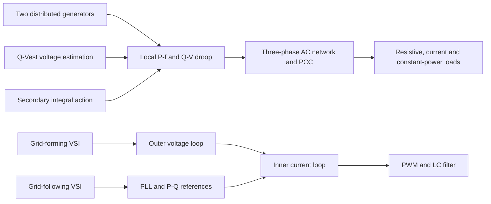

# AC Microgrid Energy Management and Inverter Control

A MATLAB/Simulink study of distributed droop control and grid-forming/grid-following three-phase converters in an islanded AC microgrid.

This DENSYS master's project combines two related studies: distributed energy
management for a two-generator AC microgrid and cascaded control of switching
voltage-source inverters. It covers Labs 4-6 only. Earlier DC/DC converter labs
are deliberately excluded.

**Reproducibility status:** the report, parameter scripts and model archives were
reviewed and organized; the Simulink models were not executed during repository
preparation. Numerical statements below are therefore labeled either as
parameter-file evidence or report-only observations.

## Engineering challenge

In an islanded microgrid, inverter-interfaced distributed generators must share
load while maintaining acceptable voltage and frequency. Classical droop
control achieves decentralized active-power sharing but can distribute reactive
power poorly when feeder impedances differ. At converter level, grid-forming
inverters must establish voltage and frequency, whereas grid-following inverters
must synchronize to an existing grid and regulate injected current and power.

## Technical approach



For an inductive network, the report uses the primary droop laws

$$\omega_i=\omega_n-m_iP_i,\qquad V_i=V_n-n_iQ_i$$

with locally measured active and reactive power filtered before feedback. The
modified Q-V-estimated method uses terminal voltage, output current and feeder
impedance to estimate the PCC voltage, then corrects the reactive-power command.
A local integral term on DG1 restores frequency but, according to the report,
disturbs proportional active-power sharing.

The Lab 6 converter uses an LC output filter and synchronous-reference-frame
control. Grid-forming operation cascades an outer capacitor-voltage loop and a
faster inner inductor-current loop. Grid-following operation uses a PLL, active/
reactive power references and the inner current loop while the grid establishes
voltage and frequency.

See the [technical summary](docs/technical-summary.md) for equations, control
boundaries, units and evidence labels.

## Repository structure

```text
models/
  lab4-5-droop/       Two-DG droop and secondary-control model
  lab6-inverters/     Grid-forming and grid-following switching models
src/matlab/           Read-only project manifest helper
tests/                Non-simulation file-layout check
docs/                 Audit, workflow, issues, verification and portfolio text
report/               Report publication note; source report held locally
results/              Placeholder for generated outputs; contents ignored
```

[Complete file inventory](docs/audit.md) ·
[Execution workflow](docs/workflow.md) ·
[Known issues](docs/issues.md) ·
[Copy mapping](docs/repository-structure.md)

## MATLAB requirements

The models identify MATLAB **R2025a** in their embedded metadata. Expected
products are:

- MATLAB and Simulink
- Simscape
- Simscape Electrical
- Control System Toolbox for `tf` and `margin` in the Lab 6 parameter script

Toolbox availability and runtime compatibility were not verified. The models
contain physical-network blocks, controlled electrical sources, semiconductor
converter blocks, PWM logic and solver-configuration blocks.

## Using the models

Clone the repository and start MATLAB in its root directory. The helper only
locates and validates files; it does not change the workspace or run a model.

```matlab
addpath('src/matlab')
cases = project_files();
disp(cases)
```

For the droop-control case:

```matlab
cd(fullfile(pwd, 'models', 'lab4-5-droop'))
run('ParametersLAb4_6_StudentVersion.m')
open_system('Lab4_6_StudentVersion.slx')
```

For Lab 6, run the shared parameter script and open exactly one inverter model:

```matlab
cd(fullfile(pwd, 'models', 'lab6-inverters'))
run('parameters_StudentVersion.m')
open_system('inverter_switching_StudentVersion.slx')              % grid-forming
% or:
open_system('inverter_switching_GridFollowing_StudentVersion.slx') % grid-following
```

The Lab 6 script calls `tf`, `margin` and `legend`, so it creates a control-
analysis figure as a side effect. It also contains `clear` and `clc`; save any
important workspace data before running it. Simulation is an optional future
step and should follow a review of switches, references, solver settings and
signal logging.

## Inputs and operating parameters

| Quantity | Lab 4-5 value | Lab 6 value | Evidence |
|---|---:|---:|---|
| Switching frequency | 15 kHz | 20 kHz | Parameter scripts |
| Nominal/reference frequency | 60 Hz for both DGs | `Fref = 50 Hz`; PLL/grid `wrated = 2*pi*60 rad/s` | Parameter scripts; inconsistency retained |
| AC voltage reference | 110 V rated DG voltage | 40 V RMS converter reference; 110 V RMS grid | Parameter scripts |
| DC-link voltage | Not parameterized in the script | 800 V | Parameter script |
| Filter | PCC 20 uF; CPL 0.4 mH/20 uF | 1 mH, 0.1 ohm, 300 uF | Parameter scripts |
| Current-loop natural frequency | - | 12,000 rad/s | Parameter script |
| Voltage-loop natural frequency | - | 1,200 rad/s | Parameter script |
| Simulation duration | 30 s | 0.2 s | Saved model configuration |

The Lab 4-5 parameter script sets DG1 to 3 kW/1.5 kVAr and DG2 to
4 kW/0.75 kVAr. The report table instead labels DG2 as 1 kW. This discrepancy
is unresolved; neither value has been silently changed.

## Reported findings

These observations come from the final report and have **not** been independently
reproduced in this repository preparation:

- Classical droop produced proportional active-power sharing but unequal
  reactive-power sharing under unequal feeder impedances.
- The Q-V-estimated modification improved reactive-power balance in the
  constant-power-load case.
- DG1-based secondary control restored nominal frequency while sacrificing
  proportional active-power sharing.
- The grid-forming controller reportedly tracked a 20-to-40 V d-axis reference
  step at about 0.1 s with a well-damped response.
- The grid-following case reportedly tracked a 0-to-4 A d-axis current step at
  0.04 s; the report estimates about +/-0.5 A q-axis switching ripple and a
  startup q-axis-voltage undershoot near -85 V.

These are simulation observations, not experimental measurements or hardware
validation. The original plots do not provide exported numeric datasets from
which the stated transient metrics can be recalculated.

## Limitations

- No model was compiled or simulated during curation.
- Initial switch positions and active controller variants must be confirmed in
  MATLAB before comparing cases.
- The parameter/report inconsistencies listed in [known issues](docs/issues.md)
  prevent a fully specified reproduction claim.
- No hardware-in-the-loop, real-time or laboratory inverter measurements are
  supplied.
- Stability margins, harmonic distortion, energy balance and controller
  robustness were not numerically verified from exported data.

## Academic context and contribution

DENSYS 2.0 master's programme, Université de Lorraine, Microgrid Management,
2026. Report: *Energy Management Strategy: AC/DC Converters - Lab 4, 5, 6*.
Authors: Elisabeth von Schoenberg and Md Atiq Aziz. Submitted to Dr. Serge
Pierfederici.

**Portfolio owner:** Md Atiq Aziz. **Individual contribution:** [confirm the
specific modeling, controller implementation, simulation analysis and report
sections completed by Md Atiq Aziz]. The repository does not imply sole
authorship of the team report or ownership of course-provided model templates.

## Citation, license and contact

Use [CITATION.cff](CITATION.cff) for project attribution. Original project code
and repository documentation are available under the [MIT License](LICENSE),
subject to the exclusions in [THIRD_PARTY_NOTICES.md](THIRD_PARTY_NOTICES.md).

Published repository: [sadat013/ac-microgrid-inverter-control](https://github.com/sadat013/ac-microgrid-inverter-control)

Name: Md Atiq Aziz · GitHub: [sadat013](https://github.com/sadat013) · Contact: via GitHub profile
